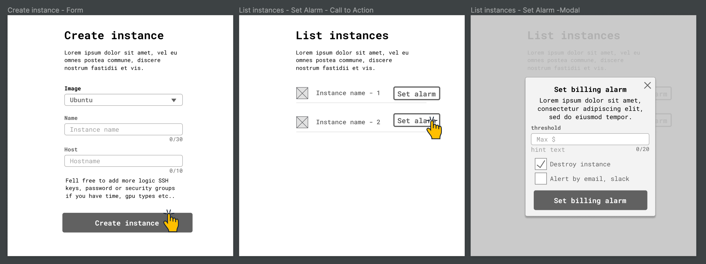

# Billing Alert Manager
At Genesis Cloud, we offer two different interfaces to manage the CPU/GPU instances: the web dashboard and a Public API. As it’s fairly easy to launch multiple GPU instances programmatically, it’s hard to keep track of the cost estimations/projections for the on-demand usage. In order to keep control of these costs, we propose you design and implement a billing alert manager. The goal is to take advantage of the Public API to monitor active instances and configure alarms to be triggered when a certain cost threshold is reached. We’ll leave to you the more specific requirements and the kind of notification you will trigger. You will need to create a [Genesis Cloud account](https://gnsiscld.co/mokvno) and an [API Token](https://account.genesiscloud.com/dashboard/security), but other than that, the sky is the limit!

Here is a low fidelity mockup that illustrates a possible solution for the challenge goal:

You don’t need to follow the mockups, they’re just intended to serve as an inspiration for you, do not limit yourself by it.

Check our [public documentation](https://developers.genesiscloud.com/) to get started with the Public API. You can assume that the pricing is the same for all instance types (e.g. $0.10 per hour) as we currently don't expose that billing information.

Final note: If there's anything you don't understand or is ambiguous, open an issue in your repository with the question ;)

---

[Go back to the Problems README](README.md)
